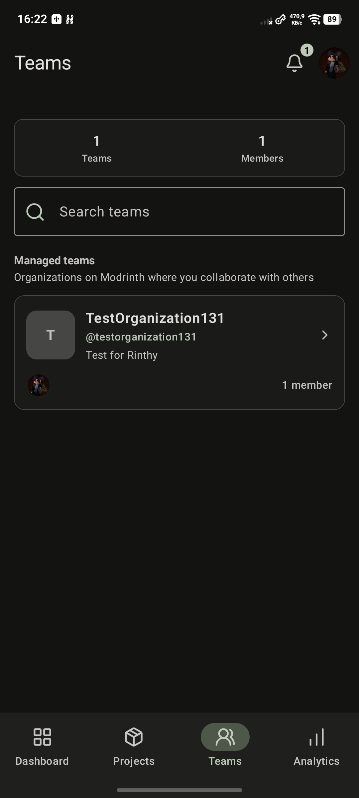
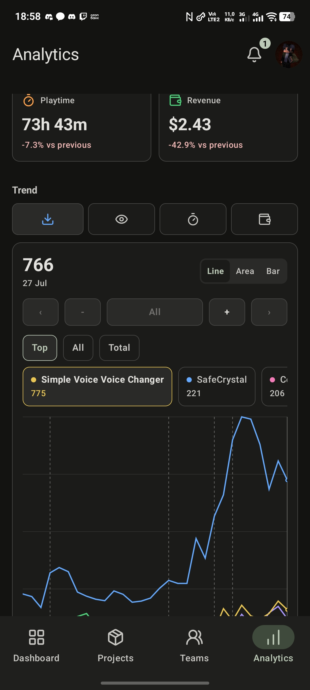

# Rinthy

<div align="center">
  
  <p><strong>A native mobile Modrinth dashboard for creators.</strong></p>
  <p>Manage projects, teams, versions, notifications, and analytics from your phone.</p>
</div>

> Rinthy is an unofficial app for Modrinth. It is not affiliated with, endorsed by, or maintained by Modrinth.

## Community

Join the Rinthy Discord server: https://discord.gg/6H5vDq2wk7

## Screenshots

<div align="center">
  
  
  
  
</div>

## What Rinthy Can Do

- Sign in with Modrinth OAuth, with PAT login available as a fallback.
- View, search, and manage your Modrinth projects.
- Edit project metadata, links, descriptions, status, icons, banners, and gallery images.
- Manage versions, loaders, game versions, dependencies, files, and release metadata.
- Work with teams and organizations, including members, permissions, invites, ownership, and organization projects.
- Open related projects directly from notifications and accept organization or project invitations.
- View analytics for downloads, views, playtime, revenue, trends, and per-project performance.
- Check balance and payout history where Modrinth exposes that data.
- Edit your Modrinth profile, avatar, bio, and account details.
- Customize the app with Material 3 Android themes and native iOS appearance, including light and dark modes.
- Use the app in English, Russian, and other community-contributed languages.
- Receive local background notifications or optional instant notifications through the limited relay.
- Get native update notices from GitHub Releases with the correct APK or IPA download for your platform.

## Downloads

Android builds are published as APK files in [GitHub Releases](https://github.com/Ryntra-App/Ryntra/releases).

iOS builds are distributed as an unsigned IPA for sideloading. To install the iOS app, use Sideloadly on a computer, sign in to iCloud on Apple's official iCloud app or website, connect your iPhone or iPad with a cable, install the IPA, then trust the developer profile in device settings and enable Developer Mode if iOS asks.

The app checks GitHub Releases for newer versions and opens the matching APK or IPA asset when an update is available. The Appetize ZIP is an unsigned Simulator build and cannot be installed on a physical device.

## Authentication

Rinthy uses Modrinth OAuth for normal sign-in. PAT login is still available as a fallback for development or recovery.

Tokens are stored locally on your device using Android Keystore or the iOS Keychain.

## Local Development

### Requirements

- Android Studio with JBR 21 and Android SDK 36.
- Xcode 16 or newer for iOS builds.
- No Node.js, CocoaPods, or web runtime is required.

### Android Build

Run shared tests and build the Android app:

```bash
./gradlew.bat :shared:testAndroidHostTest :androidApp:assembleDebug
```

The debug APK is written to `androidApp/build/outputs/apk/debug/`.

For a release build:

```bash
./gradlew.bat :androidApp:assembleRelease
```

Configure a signing key in Android Studio or Gradle before distributing a release APK.

### iOS Build

Open `iosApp/Ryntra.xcodeproj` on macOS and run the `Ryntra` scheme. The Xcode build phase embeds the matching Kotlin Multiplatform framework automatically.

The app supports iOS 16.0 and newer on iPhone and iPad. Release builds use optimized whole-module Swift compilation.

For sideloading, build or download the unsigned IPA and install it with Sideloadly or another trusted sideloading tool.

### Codemagic

The repository includes three Codemagic workflows:

- `android-native`, which runs shared tests and builds the Android debug APK.
- `ios-native`, which builds a Release iOS Simulator app and packages `Ryntra-simulator.zip` for Appetize.
- `ios-unsigned-ipa`, which builds a Release ARM64 device app and packages `Ryntra-unsigned.ipa` for sideload signing.

The unsigned device workflow intentionally disables Codemagic signing. It is still a Release build; Sideloadly applies the provisioning profile later.

## Notifications

Notification privacy, Firebase/APNs setup, relay deployment, and troubleshooting are documented in [Notification setup](docs/NOTIFICATIONS.md).

The normal Rinthy session token never goes to the notification relay. Instant notifications use a separate limited Modrinth authorization with only the permissions required to read notifications.

## Translations

See [Translating Rinthy](docs/TRANSLATING.md) for the Android and iOS translation workflow, validation command, language rules, and notification locale requirements.

---

# Русский

Rinthy — неофициальное нативное мобильное приложение для авторов на Modrinth.

С ним можно управлять проектами, версиями, командами, организациями, уведомлениями и аналитикой прямо с телефона или планшета.

## Скриншоты

<div align="center">
  
  
  
  
</div>

## Возможности

- Вход через Modrinth OAuth и запасной вход по PAT.
- Просмотр, поиск и управление проектами Modrinth.
- Редактирование метаданных, ссылок, описаний, статуса, иконок, баннеров и галереи.
- Управление версиями, загрузчиками, версиями игры, зависимостями, файлами и метаданными релизов.
- Работа с командами и организациями: участники, права, приглашения, владелец и проекты организации.
- Переход в связанные проекты прямо из уведомлений и принятие приглашений.
- Аналитика по загрузкам, просмотрам, playtime, доходу, трендам и отдельным проектам.
- Просмотр баланса и истории выплат, если эти данные доступны через Modrinth.
- Редактирование профиля, аватара, био и данных аккаунта.
- Нативные темы Android Material 3 и iOS, светлый и тёмный режимы.
- Поддержка английского, русского и других языков, которые добавляет сообщество.
- Локальные фоновые уведомления и необязательная мгновенная доставка через relay-сервис.
- Нативное уведомление о новых версиях с правильной ссылкой на APK или IPA.

## Установка

Android-версия публикуется APK-файлом в [GitHub Releases](https://github.com/Ryntra-App/Ryntra/releases).

iOS-версия доступна как unsigned IPA для sideloading. Чтобы установить приложение на iPhone или iPad, скачай IPA, подпиши его через Sideloadly или другой trusted sideloading-инструмент, установи приложение и доверь профиль разработчика в настройках устройства, если iOS попросит.

Приложение само проверяет GitHub Releases и показывает новую версию, когда она доступна. Кнопка скачивания открывает настоящий asset-файл нужной платформы. ZIP для Appetize предназначен только для iOS Simulator.

## Авторизация

Основной вход работает через Modrinth OAuth. PAT-вход оставлен как запасной вариант для разработки или восстановления доступа.

Токены хранятся локально в Android Keystore или iOS Keychain.

## Локальный запуск

### Требования

- Android Studio с JBR 21 и Android SDK 36.
- Xcode 16 или новее для iOS-сборок.
- Node.js, CocoaPods и web-runtime не требуются.

### Android-сборка

```bash
./gradlew.bat :shared:testAndroidHostTest :androidApp:assembleDebug
```

Debug APK появится в `androidApp/build/outputs/apk/debug/`.

Для Release-сборки:

```bash
./gradlew.bat :androidApp:assembleRelease
```

Перед публикацией настрой signing key в Android Studio или Gradle.

### iOS-сборка

Открой `iosApp/Ryntra.xcodeproj` на macOS и запусти схему `Ryntra`. Build phase Xcode автоматически подключает подходящий Kotlin Multiplatform framework.

Приложение поддерживает iOS 16.0 и новее на iPhone и iPad. Release-сборка использует оптимизированную whole-module компиляцию Swift.

Для sideloading можно скачать unsigned IPA и установить его через Sideloadly или другой trusted sideloading-инструмент.

### Codemagic

В `codemagic.yaml` есть три workflow:

- `android-native` запускает shared-тесты и собирает Android debug APK.
- `ios-native` собирает Release-приложение для iOS Simulator и пакует `Ryntra-simulator.zip` для Appetize.
- `ios-unsigned-ipa` собирает Release ARM64-приложение и пакует `Ryntra-unsigned.ipa` для последующей подписи.

Unsigned workflow намеренно отключает подпись Codemagic. Это всё равно Release-сборка, а provisioning profile добавляется через Sideloadly.

## Уведомления

Настройка уведомлений, Firebase/APNs, relay-сервера и диагностика описаны в [docs/NOTIFICATIONS.md](docs/NOTIFICATIONS.md).

Обычный токен сессии Rinthy не отправляется в relay. Мгновенные уведомления используют отдельную ограниченную авторизацию Modrinth.

## Переводы

Смотри [docs/TRANSLATING.md](docs/TRANSLATING.md), чтобы добавить язык одновременно для Android, iOS и серверных уведомлений.

## Сообщество

Discord-сервер Rinthy: https://discord.gg/6H5vDq2wk7
